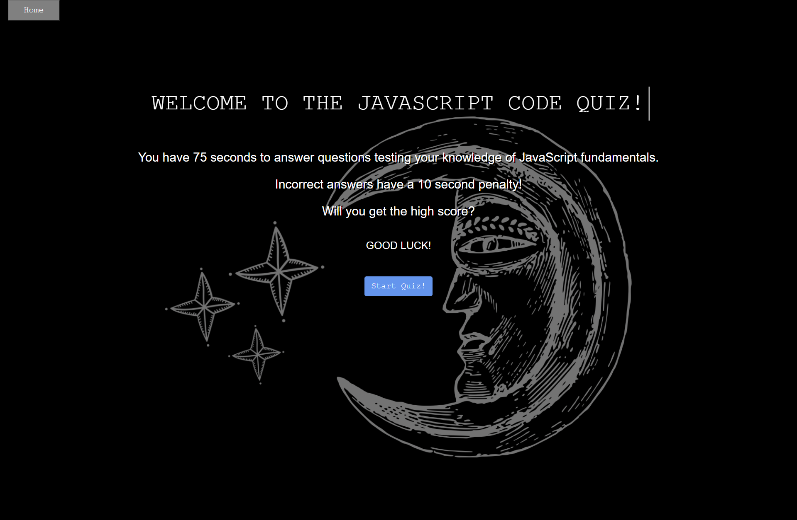

**Codin-quiz-mian-interface**

 Talking about the features of the project, the user can test their skills and knowledge on the programming skills. The project scope sought to provide a timed quiz web application that stores high scores enabling students to gauge their progress compared to their peers. The design of this project is pretty simple so that the user won’t find any difficulties while working on it.
 
 For the development of this simple web-based project, there is use of some images and it is developed using JavaScript to bring the final output. All the validation function is set from **JavaScript** whereas **HTML** and **CSS** are set for the layouts and other minor functions.
 
**How to run?**

 To run this project, we recommend you to use Modern browsers such as Google Chrome, Mozilla Firefox. To run the project, first, open the project in your browser by clicking the index.html file.
 

