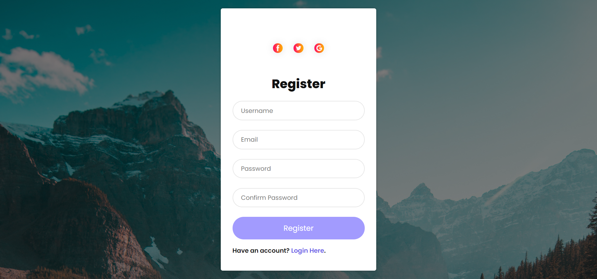

**PHP with database**

 Talking about the features of the project, the user can registration and login by this project. This project is allow the user to login and logout.
 For the development of this project, there is use of some images and it is developed using JavaScript to bring the final output. All the validation function is set from **JavaScript** whereas **HTML** and **CSS** **php** and **database** are set for the layouts and other minor functions.
 
**How to run?**

 First you install the Xampp or Wamp server in your PC.
 2nd step you may downlod the zip file of the project.Extract the zip file that your on choice folder.
 After at you must place the folder inside the xammp/htdocs
 Insdie the project you must see the file of database that is exported file name database you must create the database in-side phpmyadim and import the file which name is database .
After complete all the process you must run the project on localhost. When project is run ssuccessfully than user must enter the relevent deatils on regestrtaion page  and move to the login page. After login user may allow to logout and move back to the next page.

**##Registration insterface##**

**##Login insterface##**

