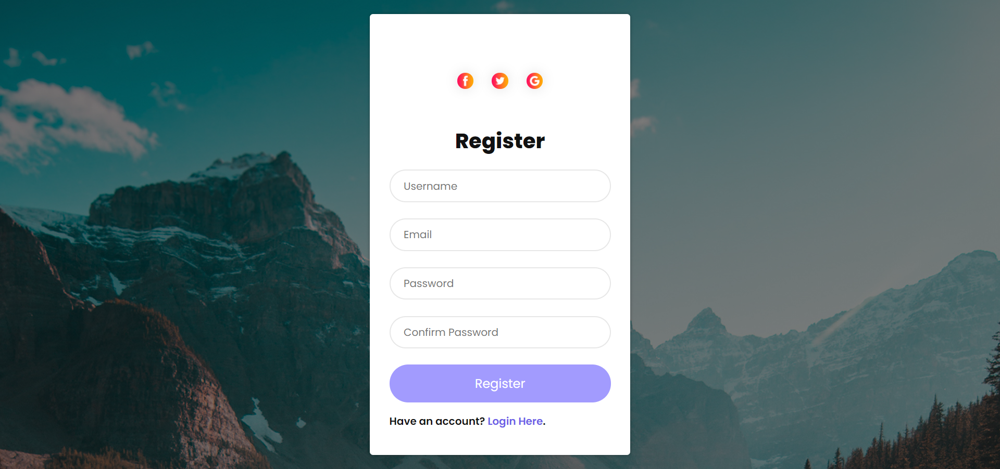

**PHP with database**

 Talking about the features of the project, the user can use registration and login by this project. This project allows the user to log in and log out.
 For the development of this project, some images are used, and it is developed using JavaScript to bring the final output. All the validation function is set from **JavaScript** whereas **HTML** , **CSS** ,**PHP** and **database** are set for the layouts and other minor functions.
 
**How to run?**

 First step, you need to install the Xampp or Wamp server on your PC by running this project.
 2nd step, you may download the zip file of the project. Extract the zip file that you're in the chosen folder.
 After at you must place the folder inside the xammp/htdocs
 Inside the project, you may see the file of the database that is exported file name database. You must create the database in-side PHPMyAdmin and import the file which name is a database .
After complete all the processes, you must run the project on localhost. When the project is run successfully, than user must enter the relevant details on the registration page and move to the login page. After login user may allow to log-out and move back to the next page.

**##Registration insterface##**

**##Login insterface##**

